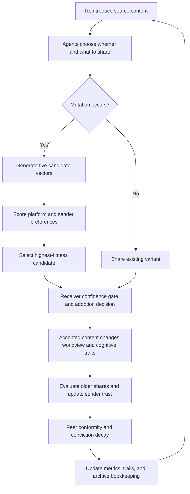

# Drift — hackathon guide

> **Ideas move. Beliefs follow.**
>
> Drift is an interactive experiment about how ideas evolve when social incentives reward some versions more than others—and how those ideas change the people passing them along.

Use this guide to understand the project, rehearse a demonstration, explain the mathematics, and answer judges’ questions. It describes the current implementation rather than a proposed future version.

## 1. The project in 30 seconds

**Pitch:**

“An idea rarely travels through a network unchanged. People favor versions that fit their beliefs, and platforms can reward versions that attract attention. Drift lets you watch that process. We start with 200 source tweets represented as 256-dimensional embeddings. Simulated people share, reject, and mutate them. Every mutation competes against four alternatives under platform incentives and the sender’s cognitive biases. As ideas spread, agents’ worldviews, rigor, emotional susceptibility, and trust relationships evolve too. You can change the incentives, inspect a lineage—even after it dies—and export its final embedding.”

**The question it explores:**

What kinds of ideas survive under a particular social and platform environment, and what happens to that environment as people consume them?

**What it is:** an exploratory, agent-based simulation with inspectable assumptions and reproducible random seeds.

**What it is not:** a validated prediction of a real society, a fact-checking system, or proof that any group of people is irrational.

## 2. What we are trying to convey

Three feedback processes sit at the center of the project:

1. **Content adapts to incentives.** A mutation can become more competitive because of its framing, not because its underlying claim became more accurate.
2. **Audiences are not fixed.** Consuming content changes an agent’s worldview and, under the model’s rules, its rigor and emotional susceptibility.
3. **Social success changes credibility.** Agents revisit earlier shares and update trust in their senders based on subsequent spread and their own preferences.

These processes interact. An emotionally attractive variant might spread, condition its audience, and help its sender become more trusted. A different environment may reward careful content instead.

The model makes these mechanisms explicit. Their presence is a design assumption; the particular trajectories, surviving branches, and network patterns arise from their interaction. Changing an incentive and observing a different outcome is evidence about this simulation, not automatically about a real platform.

## 3. The ingredients

| Element | Representation | Role |
| --- | --- | --- |
| Original content | 200 supplied tweet records | Fixed roots of the evolutionary trees |
| Meaning | One normalized 256D vector per tweet | Enables similarity, mutation, and projection |
| Semantic reference points | Rigor, outrage, absurdity, simplicity | Define the selection landscape |
| People | 320 agents in the default scenario | Hold beliefs, share content, and learn |
| Relationships | A small-world network with directional trust | Controls who encounters whose ideas |
| Time | Discrete simulation ticks | Advances sharing, feedback, and forgetting |
| Platform incentives | Four adjustable weights | Favor particular trait alignments during mutation selection |

The embedding encoder is `C10X/Qwen3-Embedding-TurboX`, used through model2vec. The frontend loads embeddings; it does not run that encoder on every tick.

Tweet metadata and embedding rows are joined **by array index**. All four semantic anchors must come from the same embedding space as the tweets. A shared dimension count alone is insufficient.

The current file has 200 records: **102 have a score below 0.5 and 98 have a score at or above 0.5**. Do not present the interface’s threshold split as exactly 100/100. The supplied metadata does not, by itself, establish independent ground truth or authenticated social-media provenance.

### A naming trap: “rationality”

For a **meme**, the field named `rationality` runs in this direction:

- **0:** the model’s rational end.
- **1:** the model’s irrational end.

The legacy field `irrationality` has the same value. Table labels such as **Irr.** reflect this direction.

For an **agent**, greater epistemic rigor means a higher `rho`. The **Societal rationality** metric averages agent rigor, so higher means more rigor. These are different quantities with different directions.

## 4. What happens during a tick?



A tick is a model step, not a day or a measured unit of human behavior. Normal playback targets 20 ticks per second before the speed multiplier. Machine performance affects wall-clock playback; use tick counts to compare runs.

### A. Choosing content to share

Each agent has a broadcast probability. When it broadcasts, its content choice favors conviction and virality:

`share weight = conviction × (0.25 + virality)`

It then reaches a limited number of network neighbors. A share may retain the same variant or produce a new one.

### B. Mutation creates alternatives; selection chooses one

With mutation variance `v`, each of five proposals is:

`candidate = normalize(parent − Σ alpha[k] × anchor[k] + noise)`

Each `alpha[k]` is sampled from a zero-mean Gaussian with variance `v`. Every coordinate of the residual noise uses that variance too. The implementation therefore uses standard deviation `sqrt(v)`.

The coefficients are signed: the minus sign does not mean every mutation moves away from every anchor. Random variation still exists; the upgrade is that its alternatives now compete under a trait-dependent fitness function.

For each trait:

`weight[k] = lambda × platform[k] + (1 − lambda) × agentBias[k]`

Sender biases are:

| Trait | Agent bias |
| --- | --- |
| Rigor | `rho` |
| Outrage | `epsilon` |
| Absurdity | `(1 − rho) × epsilon` |
| Simplicity | `1 − rho` |

Fitness is the weighted sum of cosine alignments with the four anchors. **The highest-scoring candidate wins**; the implementation uses argmax, not Boltzmann sampling.

Defaults are `lambda = 0.65` and platform weights `[0.1, 1.0, 0.4, 0.8]` for rigor, outrage, absurdity, and simplicity. Thus, the default platform already favors outrage and simplicity. This preference is an input assumption, not a discovered empirical result.

Only the winning proposal becomes a new meme. Losing proposals contribute scores to the selection record but are not counted as created memes.

### C. A winner still has to survive transmission

Winning the candidate contest does **not** guarantee adoption.

First, the receiver applies bounded confidence:

`cosine(receiver worldview, meme) >= 1 − tau`

A higher `tau` allows more distant ideas through. If the gate passes, adoption is probabilistic:

```text
z = 2 × affinity
  + 2.5 × (trust − 0.5)
  + 3 × susceptibility × virality
  − 2.5 × rigor × cognitiveLoad
  − 1.5 × memeIrrationality × rigor

P(adopt) = 1 / (1 + exp(−z))
```

These coefficients are chosen modeling parameters. One notable assumption is that rigorous agents incur a larger penalty for cognitively demanding content. Mention this if discussing the model’s disadvantage for nuanced claims.

### D. Ideas change their audiences

After adoption:

- The worldview moves toward the accepted vector, controlled by learning rate `alpha`, then is normalized.
- Rigor changes by `driftDelta × (0.5 − memeIrrationality)` before clamping.
- Susceptibility changes in the opposite direction, scaled by `0.6`.
- Peer conformity subsequently pulls rigor and susceptibility toward neighborhood averages.

Rigor and susceptibility are plastic in the current implementation. Bounded confidence and learning rate vary between agents but are not dynamically adapted by these plasticity equations.

The current engine also gives each agent heterogeneous attention, novelty seeking, and confirmation bias. Repeated exposure builds familiarity but eventually creates fatigue, while attention scales the final adoption probability. Every 24 ticks, very weak trust ties can be replaced by a high-trust, semantically compatible connection. Mutations now adapt their total variance to virality, rigor, and cognitive load, and a subset of mutations recombine two memes before selection. These additions make drift depend on memory, identity, and network structure instead of only on the current meme vector.

### E. Trust responds later

After an evaluation delay, receivers revisit earlier shares. A prestige-oriented component rewards content that spread; a rigor-oriented component considers the meme’s irrationality and spread. Their relative influence depends on the receiver’s susceptibility and rigor.

This is a retrospective behavioral rule, not an external truth-verification step. Trust is directional: one agent’s trust in another need not be reciprocated.

Finally, conviction decays. Agents forget content or evict weak inventory entries. A meme becomes unheld when no agents currently carry it.

## 5. How to read the interface

### Run telemetry

| Indicator | Actual meaning | Avoid this interpretation |
| --- | --- | --- |
| Societal rationality | Mean agent epistemic rigor | Percentage of objectively correct people |
| Meme climate | Conviction-weighted average of `1 − memeIrrationality` across held content | Percentage of verified true tweets |
| Polarisation | Bimodality coefficient of agents’ first projected worldview coordinate | A definitive count of political camps |
| Transmission | Smoothed accepted exposure events per tick | Unique new believers or new meme variants |
| Mean peer trust | Mean of stored directional trust entries | A survey of societal trust |
| Mutated this run | Created variants divided by roots plus created variants | Probability that a given broadcast mutates |
| Currently circulating: mutated | Held variants divided by all held unique memes | Percentage of agents who changed their minds |
| Highest generation | Deepest variant created during the run | Current tick or number of shares |

**Example:** 200 roots plus 300 variants gives `300 / 500 = 60%` mutated this run. If 20 variants and 30 roots are currently held, the circulating mutation percentage is `20 / 50 = 40%`. Rejected and archived variants remain in the run-wide count.

The run-wide percentage is cumulative and normally increases as variants are created. That alone says nothing about whether those variants spread successfully.

The polarisation captions are heuristic. The coefficient depends on a one-dimensional projection; even the current implementation’s degenerate zero-variance case returns a high value. Inspect the agent distribution rather than treating a caption as a definitive diagnosis. History charts use bounded buffers; in long runs, a displayed comparison with the oldest retained point is not necessarily a comparison with tick zero.

### Semantic observatory

**Meme Cosmos:** larger colored nodes are original tweets; smaller nodes are mutations; curved links show immediate parentage. Cyan indicates the rational end, amber the midpoint, and pink the irrational end of the model’s score. Squares label projected semantic anchors.

**Agent space:** points are agents, positioned by their worldview embeddings and colored by rigor (cyan high, pink low). Click to inspect their inventory, trust, and cognitive history.

**Trust network:** blue edges represent relationships, with strength and visibility reflecting trust; cyan-to-pink pulses visualize the irrationality of transmitted memes.

These views answer different questions: where ideas move, where people move, and who connects them.

The cosmos uses PCA to compress 256 dimensions to two. Its basis is fitted to roots and stays fixed within a run, making movement easier to compare. The displayed explained-variance percentage indicates how much variation the two axes retain. Screen proximity is not the complete semantic distance. Zooming or resizing changes display coordinates without changing embeddings.

### Drift and lineage inspector

- **Generation 0:** original tweet. It remains zero forever.
- **Generation 3:** three mutation steps from the root, not three shares.
- **Root drift:** `1 − cosine(variant, root)`, theoretically between 0 and 2. It measures displacement, not a percentage of meaning lost.
- **Trait radar:** alignment with each reference anchor; center is −1, middle ring is 0, outer edge is +1. These are similarities, not independent probabilities.
- **Selection attribution:** the five candidate scores and the platform/agent contributions explain the mutation contest. They do not explain every later acceptance or rejection.

The drift scatter groups currently held descendants by root. X is average virality. Y is the average of `root drift / generation`. Despite the “velocity” label, this is neither a time derivative nor the sum of all parent-to-child movements.

### Meme activity and dead lineages

| Filter | What you see |
| --- | --- |
| Latest mutations | Recently created variants, newest first |
| Circulating | Memes with at least one current holder |
| Original tweets | The generation-zero roots |
| Extinct / unheld | No current holders, including never-adopted and archived variants |

The table’s `R₀` is `adoptions / exposures × configured fanout`, a simulation proxy. Initial grants and re-exposures affect the counters; do not present it as a rigorously estimated epidemiological reproduction number. Reach is current holders divided by agent population.

“Extinct” includes mutations that were never adopted. It does not necessarily mean an idea became popular and later disappeared. Inspect lifetime adoptions and lineage before telling that story.

Archived variants remain inspectable for the current run. Restart, structural changes, switching presets, or reloading clear that run’s archive. Export important snapshots first.

### End-state embedding and meaning

Select a meme and use **Capture now**, or set additional ticks and choose **Run & interpret**. The latter pauses at the requested tick and captures the selected variant’s deepest descendant, including archived descendants. Ties favor the most recently created tick. This is not necessarily the most popular, most drifted, or currently alive descendant.

The JSON report preserves the vector, root vector, source text, generation, captured tick, seed/configuration, alignments, nearby source tweets, and any interpretation.

**Important:** mutation changes embeddings and numerical traits, not the displayed tweet prose. A descendant may display the original sentence while its vector has changed substantially.

The separate text backend uses nearest tweets and trait changes to propose an approximate interpretation. It is not an inverse decoder for the static encoder. It does not guarantee that a generated paraphrase would embed back to the mutated vector. Export and nearest-neighbor inspection work without a configured text model.

### Arrange your workspace

Drag a panel’s right edge, bottom edge, or lower-right corner to adjust its width, height, or both. Keyboard-focused handles accept arrow keys; Shift makes larger adjustments. Dimensions are saved locally. **Reset layout** changes the layout, not the simulation.

## 6. A five-minute demo

| Time | Action | Suggested narration |
| --- | --- | --- |
| 0:00–0:35 | Show the title and cosmos | “We are exploring how incentives select versions of ideas—and how those ideas change their audiences.” |
| 0:35–1:10 | Let Mixed feed run; show telemetry | “These are simulated agents trading content. Mutation count and adoption measure different things.” |
| 1:10–2:00 | Pause; select a Latest mutations row | “Here is the root, the generation, and the five-candidate competition that created this variant.” |
| 2:00–2:45 | Show the radar and selection contributions | “Its fitness combines platform incentives with the transmitting agent’s biases. Winning did not guarantee a receiver accepted it.” |
| 2:45–3:25 | Switch to agent/trust views | “The audience and its trust relationships evolve alongside the ideas.” |
| 3:25–4:00 | Select Extinct / unheld | “Failure is observable too. We preserve branches that left circulation or never found an audience.” |
| 4:00–4:40 | Capture an end state and download JSON | “The endpoint is inspectable as data. Optional generated language is an interpretation, not an exact decoded sentence.” |
| 4:40–5:00 | Close on the controls | “The experiment is to change the incentives and compare what survives.” |

### Before presenting

1. Run `npm install`, `npm test`, `npm run build`, and `npm run dev` from the project directory. Use the URL printed by Vite; the port may vary.
2. Confirm the three public dataset files load and the tick counter advances automatically.
3. Rehearse selection, pause, archive inspection, panel resizing, and JSON download.
4. If demonstrating generated interpretation, configure `.env.local` using `.env.example`, restart the server, and test a request beforehand. Never display the key.
5. If no text backend is configured, demonstrate the vector and nearest tweets. Do not describe a mock/test response as a live Qwen result.
6. Keep downloaded example snapshots for a fallback. Label them with their captured configuration and tick.

## 7. Experiments worth showing

### Experiment A: change what the platform rewards

Compare the same seed and tick horizon under two configurations:

- Baseline platform weights: rigor 0.1, outrage 1.0, absurdity 0.4, simplicity 0.8.
- Experimental alternative: rigor 1.0, outrage 0.0, absurdity 0.0, simplicity 0.1.

Keep the platform mixing weight, network, mutation probability, and other settings fixed. Set the weights, restart, and compare at the same tick. Restart retains the current configuration; loading a preset can overwrite it.

Compare mean rigor, meme climate, held mutation share, and trait alignments in surviving lineages. A rigor-favoring landscape changes candidate preferences; it does not guarantee better outcomes on every metric or every seed.

### Experiment B: more variation versus more survival

Compare mutation probability 0.08 against 0.30, leaving everything else fixed. Both settings are experimental inputs, not claimed real-world rates.

Does the generated mutation share rise without a corresponding rise in circulating variants? Inspect the unheld branches. This separates producing alternatives from successfully transmitting them.

### Experiment C: explore presets

| Preset | Conditions it sets up | Question to ask |
| --- | --- | --- |
| Mixed feed | Moderate initial traits and content supply | What does the baseline do? |
| Epistemic renaissance | Higher starting rigor and more rational-end injections | Do these conditions sustain rigor here? |
| Conspiratorial cascade | Greater susceptibility and irrational-end supply | Do salience and feedback amplify each other? |
| Echo chamber balkanisation | Tight network clustering and narrow confidence | How much content crosses community boundaries? |

Preset names describe intended scenarios, not guaranteed results. Several parameters change together, so preset comparisons cannot isolate the effect of one variable. Repeat experiments across seeds before claiming a robust effect. The app does not currently automate ensemble statistics or significance testing.

## 8. Technical architecture for judges

```text
public JSON + NPY + trait anchors
                ↓
       validation and normalization
                ↓
       MemeticEngine + EvolutionEngine
                ↓
       Zustand state and frame publication
                ↓
       Canvas views + React inspectors
                ↓
       frozen end-state snapshot → JSON download
                ↓ optional
       /api/interpret → evidence retrieval → Qwen-compatible chat model
```

| Implementation | Responsibility |
| --- | --- |
| `src/core/data/loadDataset.ts` | Parses NPY, validates dimensions, joins metadata, loads anchors |
| `src/core/engine/MemeticEngine.ts` | Tick lifecycle, transmission, trust, plasticity, archive, metrics |
| `src/core/engine/EvolutionEngine.ts` | Five mutation proposals, fitness selection, derived traits |
| `src/core/math/pca.ts` | Matrix-free power-iteration projection |
| `src/store/useSimStore.ts` | UI state, playback, exact-tick stopping, publication |
| `src/components/canvas/` | Canvas rendering and animation loop |
| `src/core/engine/snapshot.ts` | Frozen descendant selection and embedding report |
| `server/interpret.ts` | Server-side retrieval and optional text-model request |

The simulation does not make an LLM call on each mutation. Its main loop is local vector arithmetic. The text model is used only when interpretation is explicitly requested. In development, the interpretation endpoint is provided by Vite middleware; static-only hosting needs a separate backend route.

## 9. Judge questions and honest answers

**“Are you showing that outrage always wins?”**

No. The default weights favor it, and the simulation explores the consequences of that choice. Candidate variation, confidence gates, trust, and the network can still prevent a variant from spreading.

**“How do you know a tweet is rational?”**

Root scores come from supplied metadata. Descendant scores come from chosen anchor-alignment formulas. Neither is an independent truth judgment.

**“Is the mutation actually meaningful language?”**

It is a mutation in an embedding space. The score changes are mathematically defined, but an arbitrary point may not correspond to a coherent sentence. The optional text interpretation helps inspect possible meaning without claiming exact reconstruction.

**“Why use evolutionary language?”**

The model has inherited lineage, variation, differential candidate selection, and differential transmission. It is an analogy implemented as an explicit algorithm, not a claim that culture follows biological evolution in every respect.

**“Does every share increase generation?”**

No. Re-sharing an existing variant preserves its generation. Only a newly selected mutation increments generation.

**“Can another team reproduce a run?”**

With the same dataset, code, configuration, seed, and timing of interventions in ticks, the simulation is deterministic. Unrecorded live edits and external text-model output limit reproducibility. Snapshot export records capture-time configuration, not a full intervention history.

**“What is implemented versus still needed?”**

Implemented: real-file embedding ingestion, local selection/transmission dynamics, live visualization, explainable candidate scores, extinct lineage inspection, resizable panels, exact-tick snapshot/export, and a configurable interpretation backend. Real text generation additionally requires a working model endpoint and any necessary credentials.

## 10. What to build next

Good next steps are experimental validation and better measurement:

- Validate metadata and anchor choices with independently annotated examples.
- Re-embed generated paraphrases to quantify how well they match target vectors.
- Compare selection against a mutation-only control over many seeds.
- Add export of full intervention histories and whole-run metrics.
- Improve distribution diagnostics beyond the current one-dimensional polarisation proxy.
- Add larger retrieval corpora and investigate mutation operators that stay closer to meaningful sentence embeddings.

**Suggested closing line:**

“Drift makes the assumptions visible: what gets rewarded, what gets believed, and how those two processes reshape each other.”
